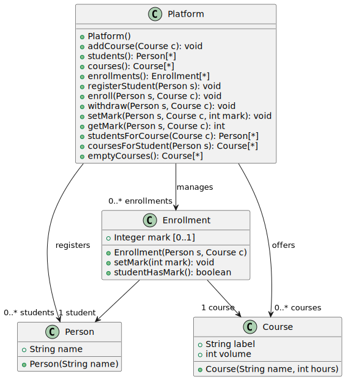

## Enoncé de l'exercice "Learning Platform"

Une plateforme d’enseignement par correspondance propose un certain nombre de cours en ligne. Les personnes enregistrées auprès de la plateforme peuvent s’inscrire à des cours en ligne, et recevoir une note pour les cours qu’elles suivent. On veut modéliser un système permettant de gérer l’enregistrement des étudiants à la plateforme, l’inscription des personnes enregistrées à des cours dispensés par la plateforme, et l’attribution des notes.

Les étudiants et les cours sont connus par leur nom, pour les cours on connaît aussi le volume horaire. Un étudiant enregistré peut s’inscrire à plusieurs cours, et recevra une note pour chacun des cours auxquels il est inscrit. Quand un étudiant s’inscrit à un cours, on ne connaît pas sa note. Plus tard, on peut spécifier la note d’un étudiant à un cours auquel il est inscrit. Une note spécifiée ne peut plus être modifiée. On veut également pouvoir désinscrire un étudiant d’un cours, s’il n’a pas encore reçu de note à ce cours.

Le système fourni permet :

- D’enregistrer de nouvelles personnes sur la plateforme (`registerStudent()`), de connaître les étudiants enregistrés sur la plateforme (`students()`) - Il faut s’enregistrer avant de s’inscrire à un cours.
- D’ajouter un cours dans les cours dispensés par la plateforme (`addCourse()`), de connaître les cours dispensés (`courses()`).
- D’inscrire un étudiant enregistré à un cours dispensé (`enroll()`), et le désinscrire s’il n’a pas reçu de note (`withdraw()`).
- D’affecter une note à un étudiant pour un des cours auquel il est inscrit (`setMark()`).
- De déterminer facilement les cours auxquels un étudiant est inscrit (`coursesForStudent()`), et les étudiants inscrits à un cours (`studentsForCourse()`).
- De déterminer facilement les cours auxquels aucun étudiant n’est inscrit (`emptyCourses()`).

On fournit le diagramme de classes ci-dessous :

---

#### Travail à réaliser :

**1° Partie :** Fournir une implémentation en Java sous la forme d’un projet Maven, conforme au jeu de tests unitaires fournis dans le projet. Vous devez obtenir 100% de couverture de tests sur la classe `Platform`, rajouter des tests unitaires si nécessaire. L’exercice doit être remis en donnant l’adresse du dépôt github où le code source est déposé (Barème indicatif : 11 points)

**2° Partie :** Vous devez ajouter les fonctionnalités suivantes (barème indicatif : 9 points) :

- Pour chaque cours, on définit une liste de livres à acheter, un livre étant défini par son titre et son éditeur. Cette liste de livres est définie à la création du cours, on ne demande pas de pouvoir la modifier ensuite.
- Pour un étudiant donné, on veut connaître les livres qu'il doit acheter, en fonction des cours auxquels il est inscrit.
- Un étudiant doit pouvoir quitter la plateforme à tout moment. Lorsqu'un étudiant quitte la plateforme, l'information concernant les cours auxquels il est inscrit est supprimée.
- La plateforme peut décider de retirer un cours de son catalogue, si une des deux conditions suivantes est remplie. a) Aucun étudiant n'est inscrit à ce cours, b) Tous les étudiants inscrits ont reçu une note. Quand la plateforme retire un cours de son catalogue, l'information concernant les étudiants inscrits à ce cours est supprimée.

- Fournir le diagramme de classes UML mis à jour pour refléter ces nouvelles spécifications, ([fichier StarUML](./doc/mooc.mdj)), barème indicatif 4 points). Faire apparaître sur le diagramme les méthodes, classes et associations ajoutées.
- Fournir l’implémentation en java en donnant l’adresse du dépôt github où le code source est déposé, contenant également les tests unitaires des nouvelles fonctionnalités (barème indicatif 5 points). Indiquez sur moodle si votre code java contient l’implémentation de la 2° partie, ou seulement celle de la 1° partie.
